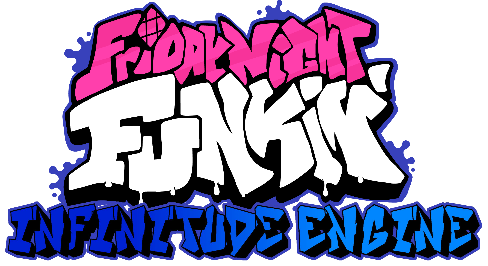

# IMPORTANT NOTE: This Engine is incomplete and you cannot use it for mods yet. The documentation, tutorials, and website don't exist yet.

# Friday Night Funkin': Infinitude Engine
## Friday Night Funkin'
[**Friday Night Funkin'**](https://github.com/FunkinCrew/Funkin) is a rhythm game originally made for Ludum Dare 47 "Stuck In a Loop".

## Infinitude Engine
**Infinitude Engine** is a recreation of Friday Night Funkin' in Unity. It is designed to improve Friday Night Funkin' for **Players** and **Modders**.

Notes:

**Infinitude Engine** is a ***MOD*** of FNF.

**Infinitude Engine** is not compatible with any other FNF Engine, including Psych Engine.

Documentation and tutorials on how to make a mod with **Infinitude Engine** are on the Infinitude Engine website.

For Players:
- Better Input System and UI
- Better Graphics
- Better Performance
- Reanimated Characters (Can be Disabled)
- Remastered Charts

For Modders:
- Fully Moddable Engine
- Tons of built-in Events
- Full Documentation
- Easy-to-use Event System (More Variables than PsychEngine)
- New Chart Editor

Features can be disabled in the Settings.cs file. (Unimplemented)

## How to setup the Infinitude Engine for modding
1. Download Unity (This was built on version 2021.3.26f1)
2. Download the Project
3. Open the project folder ("Infinitude Engine")
4. Start editing!

## MOD SUPPORT:
As of now (0.1) you aren't able to create mods without editing the project directly
I plan on using the Persistent Data Folder for mods

## Credits:
- Cobalt Bar (Creator)
- [Gamadoge](https://www.youtube.com/@Gamadoge/) (Explained Stuff about Psych Engine and FNF)
- [Psych Engine](https://github.com/ShadowMario/FNF-PsychEngine) (Assets and Code)
- [Friday Night Funkin/Funkin Crew](https://github.com/FunkinCrew/Funkin) (Assets and FNF)
- [SereBeat](https://gamebanana.com/members/1819550) (Reanimated BF, GF, Logo, Spooky Kids, Pico, and some other characters)
- Box Funkin for UI Inspiration
- Cracsthor & PhantomArcade for [PhantoMuff Font (1.1.5 and 1.2)](https://gamebanana.com/tools/7763)